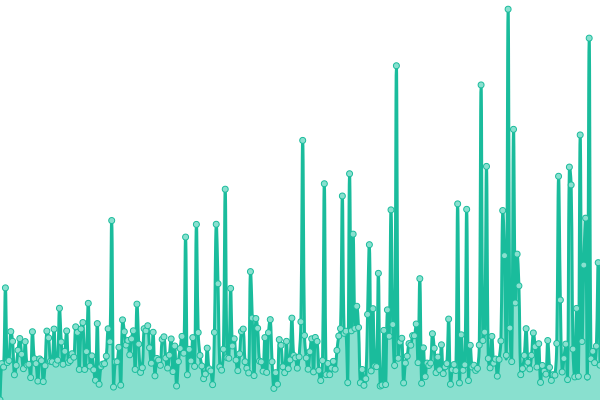
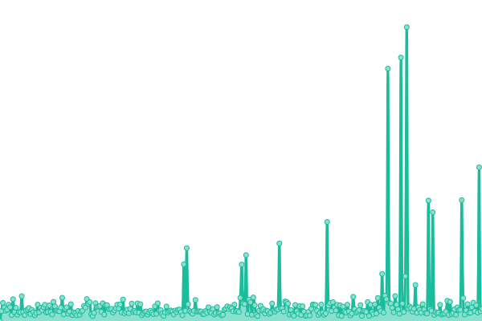
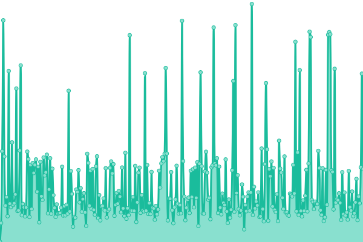

# [📈 Live Status](https://upptime.github.io/upptime): <!--live status--> **🟩 All systems operational**

This repository contains the open-source uptime monitor and status page for [Upptime](https://upptime.js.org), powered by [Upptime](https://github.com/upptime/upptime).

With [Upptime](https://upptime.js.org), you can get your own unlimited and free uptime monitor and status page, powered entirely by a GitHub repository. We use [Issues](https://github.com/upptime/upptime/issues) as incident reports, [Actions](https://github.com/upptime/upptime/actions) as uptime monitors, and [Pages](https://upptime.github.io/upptime) for the status page.

<!--start: status pages-->
<!-- This summary is generated by Upptime (https://github.com/upptime/upptime) -->
<!-- Do not edit this manually, your changes will be overwritten -->
<!-- prettier-ignore -->
| URL | Status | History | Response Time | Uptime |
| --- | ------ | ------- | ------------- | ------ |
|  [Stacks Explorer](https://explorer.stacks.co) | 🟩 Up | [stacks-explorer.yml](https://github.com/aulneau/stacks-status/commits/HEAD/history/stacks-explorer.yml) | 

 715ms
     
 | 

<a href="https://stacks-status.com/history/stacks-explorer">100.00%</a>
    

|  [Stacks node API (Mainnet)](https://stacks-node-api.stacks.co) | 🟩 Up | [stacks-node-api-mainnet.yml](https://github.com/aulneau/stacks-status/commits/HEAD/history/stacks-node-api-mainnet.yml) | 

 227ms
     
 | 

<a href="https://stacks-status.com/history/stacks-node-api-mainnet">100.00%</a>
    

|  [Transactions endpoint (confirmed)](https://stacks-node-api.stacks.co/extended/v1/tx) | 🟩 Up | [transactions-endpoint-confirmed.yml](https://github.com/aulneau/stacks-status/commits/HEAD/history/transactions-endpoint-confirmed.yml) | 

 509ms
     
 | 

<a href="https://stacks-status.com/history/transactions-endpoint-confirmed">100.00%</a>
    

|  [Transactions endpoint (mempool)](https://stacks-node-api.stacks.co/extended/v1/tx/mempool) | 🟩 Up | [transactions-endpoint-mempool.yml](https://github.com/aulneau/stacks-status/commits/HEAD/history/transactions-endpoint-mempool.yml) | 

 100ms
     
 | 

<a href="https://stacks-status.com/history/transactions-endpoint-mempool">100.00%</a>
    

|  [Blocks endpoint](https://stacks-node-api.stacks.co/extended/v1/block) | 🟩 Up | [blocks-endpoint.yml](https://github.com/aulneau/stacks-status/commits/HEAD/history/blocks-endpoint.yml) | 

 146ms
     
 | 

<a href="https://stacks-status.com/history/blocks-endpoint">100.00%</a>
    

|  [Hiro.so](https://hiro.so) | 🟩 Up | [hiro-so.yml](https://github.com/aulneau/stacks-status/commits/HEAD/history/hiro-so.yml) | 

 426ms
     
 | 

<a href="https://stacks-status.com/history/hiro-so">100.00%</a>
    

|  [stacks.co](https://stacks.co) | 🟩 Up | [stacks-co.yml](https://github.com/aulneau/stacks-status/commits/HEAD/history/stacks-co.yml) | 

 304ms
     
 | 

<a href="https://stacks-status.com/history/stacks-co">100.00%</a>
    

<!--end: status pages-->

[**Visit our status website →**](https://upptime.github.io/upptime)

## 📄 License

- Powered by: [Upptime](https://github.com/upptime/upptime)
- Code: [MIT](./LICENSE) © [Upptime](https://upptime.js.org)
- Data in the `./history` directory: [Open Database License](https://opendatacommons.org/licenses/odbl/1-0/)
